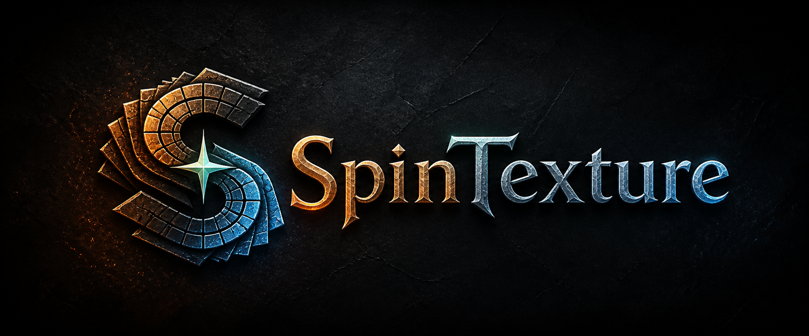
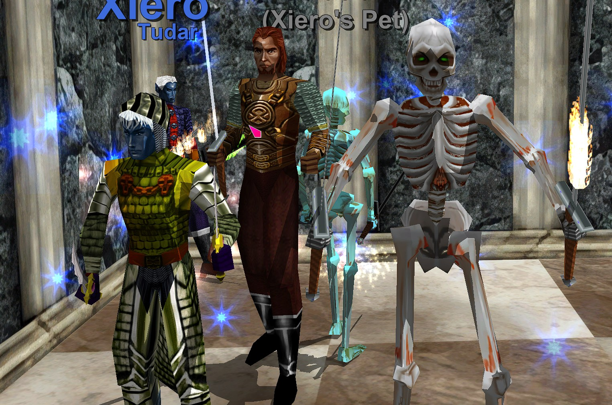
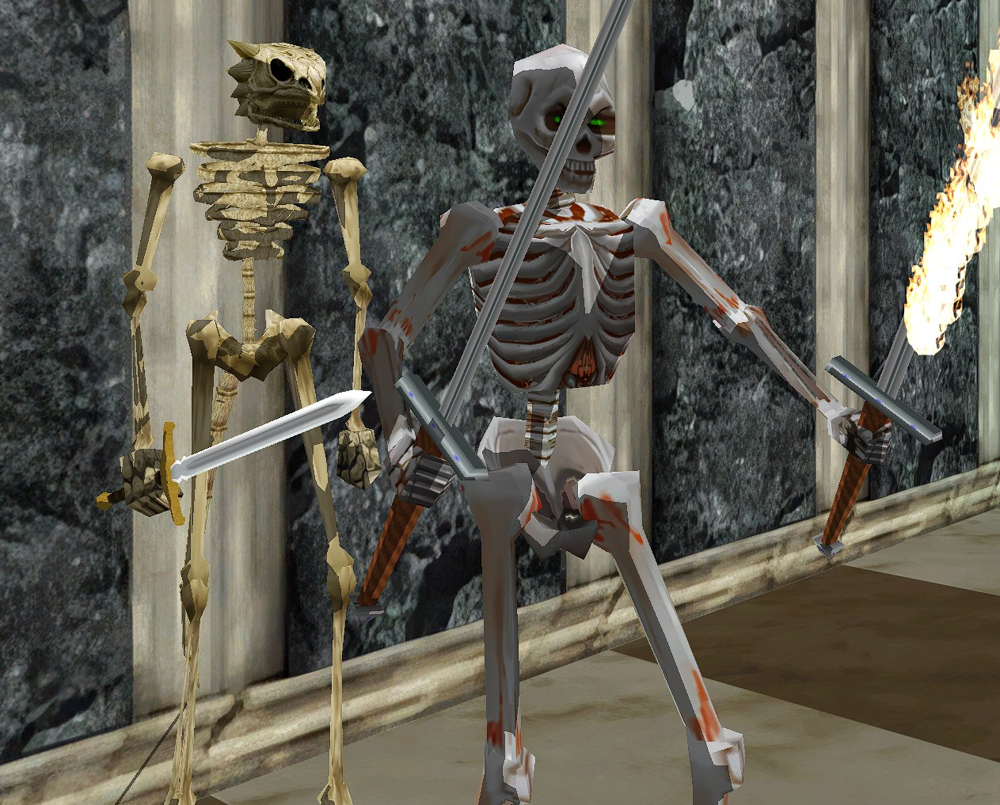

<p align="center">
  
</p>

<h1 align="center">SpinTexture for EverQuest Legends</h1>

<p align="center">
  <strong>Original Norrath. Sharper detail. Your art direction.</strong>
</p>

<p align="center">
  <a href="https://github.com/itsspin/spintexture/releases/latest"><strong>Download the latest release</strong></a>
  &nbsp;·&nbsp;
  <a href="https://itsspin.github.io/spintexture/"><strong>Compare original vs enhanced</strong></a>
  &nbsp;·&nbsp;
  <a href="#quick-start"><strong>Quick start</strong></a>
  &nbsp;·&nbsp;
  <a href="https://github.com/itsspin/SPINFOURKAYYY"><strong>4K UI scaling</strong></a>
  &nbsp;·&nbsp;
  <a href="https://github.com/itsspin/spinips"><strong>SpinUI + Loremaster</strong></a>
</p>

<p align="center">
  <a href="https://github.com/itsspin/spintexture/actions/workflows/ci.yml"></a>
  <a href="https://github.com/itsspin/spintexture/releases/latest"></a>
  <a href="https://github.com/itsspin/spintexture/releases/latest"></a>
</p>

> [!NOTE]
> SpinTexture is an independent community project for EverQuest Legends and is not affiliated with or endorsed by Daybreak Game Company.

SpinTexture is a portable Windows texture-pack builder for EverQuest Legends. It reconstructs clearer, higher-resolution world, character, armor, and equipment textures while preserving the original art direction, legacy container formats, alpha behavior, and safe fallbacks. No EverQuest assets are included with the program.

It does **not** inject a DLL, hook Direct3D, install ReShade, modify the game executable, contact game servers, or read credentials. Texture enhancements are staged outside the client, reviewed, then installed as complete verified archives with exact backups. The optional Native Graphics presets make reversible edits to five supported `eqclient.ini` values only.

| Build | Review | Install | Play | Restore |
| --- | --- | --- | --- | --- |
| Choose a zone, the world, characters + equipment, spell effects, or all safe textures. | Compare real source and final compressed textures from your own client. | Check compatible packs; SpinTexture verifies and composes them without rerunning AI. | Start the verified enhanced client without letting LaunchPad replace custom archives. | Return every managed archive and graphics setting to its exact backed-up original. |

| Enhanced characters, armor, and equipment | Enhanced world gameplay |
| --- | --- |
|  |  |



### Interactive original vs enhanced comparison

[](https://itsspin.github.io/spintexture/)

Jump directly to the **[characters + equipment comparison](https://itsspin.github.io/spintexture/#characters)**, **[Lavastorm world + equipment comparison](https://itsspin.github.io/spintexture/#lavastorm)**, or **[Nagafen's Lair world + creature comparison](https://itsspin.github.io/spintexture/#nagafen)**.

**[Open the interactive comparison gallery](https://itsspin.github.io/spintexture/)** to drag or swipe between unchanged original client screenshots and the same scenes using SpinTexture-enhanced world, character, and equipment textures. Each comparison is keyboard accessible with the arrow keys. Small pose and background-creature differences come from the live game; no capture was retouched to manufacture detail.

## Download and install SpinTexture

1. Open the [latest GitHub release](https://github.com/itsspin/spintexture/releases/latest) and download `SpinTexture-<version>-win-x64.zip` plus its SHA-256 file.
2. Optional but recommended: verify the ZIP in PowerShell. Replace the filename below with the release you downloaded.

   ```powershell
   Get-FileHash .\SpinTexture-<version>-win-x64.zip -Algorithm SHA256
   ```

3. Extract the **entire ZIP** into a normal writable folder. Do not run the app from inside the ZIP.
4. Keep `SpinTexture.exe` and the included `Tools` folder together. The portable Windows build already includes its .NET runtime and pinned upscaling workers.
5. Close EverQuest and LaunchPad, then open `SpinTexture.exe`. Choose the EverQuest Legends folder that directly contains `eqgame.exe`.

No installer, administrator access, Python setup, DLL registration, or graphics injection is required.

## Quick start

Start with one zone. It is the fastest way to confirm visual quality, GPU stability, disk usage, and the enhanced launch path before committing to a large build.

1. In **Build → Source**, choose the folder containing `eqgame.exe`, then click **Analyze Client (Read Only)**. Analysis inventories archives and textures without changing the client.
2. Under **Asset Set**, choose **Selected zone**, then select **lavastorm**.
3. Choose **Texture HD**. It is the recommended faithful-detail route for a first world build.
4. Set **Upscale ceiling (longest edge)** to **2,048 px** and leave **Generate DDS mip chains** enabled.
5. Optionally open **Live Settings Preview**. SpinTexture selects up to three safe examples from the selected client source, or SHA-verifies its managed original backup when an enhanced pack is active, and renders them with the exact selected processing route. Drag the Original/Enhanced reveal or switch samples to compare the result. Nothing is uploaded, installed, or written to the live client.
6. Review the estimated time and disk use, acknowledge the install notice, then click **Build Staged Pack**. Building writes only to SpinTexture's managed pack library; it does not install anything into EverQuest.
   The footer tracks overall job progress across the complete selected asset set, including artifact count, elapsed time, and a live ETA that recalibrates from the measured speed of the current PC as archives finish.
7. Open **Review** when the build completes. Use **Fit** to judge the whole texture and **1:1** to inspect the pixels that will actually be installed. Protected or fidelity-rejected textures remain original by design.
8. Open **Packs**, check the new Lavastorm pack, and click **Install Checked Packs**. Keep EverQuest and LaunchPad closed while SpinTexture verifies sources, creates exact backups, and atomically installs the selected archives.
9. Click **Play Enhanced EQ**. SpinTexture performs a quick integrity check and starts the enhanced client; it does not rerun the upscaler or recopy every archive each time you play.

> [!IMPORTANT]
> LaunchPad validates game archives and can replace enhanced textures with the originals whenever it starts. Use **Play Enhanced EQ** or the install-specific desktop shortcut for normal enhanced play. The shortcut starts `eqgame.exe patchme` through SpinTexture's verifier and never reads, stores, forwards, or reuses LaunchPad credentials or login tickets. Manual-login behavior can vary, so prove this path with the small zone build before creating a full-client pack.

## The five main sections

SpinTexture keeps its normal workflow in one cohesive window. Use the top navigation to move between these sections:

| Section | What to do there |
| --- | --- |
| **Build** | Analyze the client, choose an asset set and art direction, set the size ceiling, estimate the job, and create a reusable staged pack. |
| **Packs** | Filter completed builds, check everything that should be active together, inspect contents, repair an older pack, delete an unneeded pack, and install the checked selection. |
| **Review** | Compare original and final compressed textures, search archive members, keep a specific original, or redo only selected textures with another art direction. |
| **Graphics** | Preview and apply supported native Shadows, Advanced Lighting, Post Effects, Bloom, and shadow-distance settings without an injector. |
| **Storage** | Move the large reusable staged-pack library to another drive with full SHA-256 verification. Backups and recovery records stay in the install profile. |

### Choosing what to build

| Asset set | Recommended use |
| --- | --- |
| **Selected zone** | Fast visual trial or one favorite zone. Start here. |
| **World zones** | Terrain, architecture, and safe world objects. New builds default to the current EQL roster; visible era checkboxes can add installed out-of-era zones. Shared world libraries are conservatively included. |
| **Characters + equipment only** | Playable races, biological/NPC mobs, classic armor, robes, weapons, and verified equipment materials without world archives. |
| **World zones + characters + equipment** | The selected World-zone eras plus every supported playable race, mob, armor, and weapon archive. Expansion choices filter only the world half. |
| **Spell effects** | Conservative supported particle/effect artwork; unsafe animation sheets and technical assets remain original. |
| **All safe textures** | The broadest classified selection. Use only after reviewing smaller builds and confirming disk headroom. |

### Managing more than one pack

In **Packs**, every card has a green **Install** check and a separate red **Delete** check; choosing one clears the other. Clicking the rest of a card only focuses it for details, preview, or repair. You can check a character pack plus several disjoint zone packs and install them together. SpinTexture verifies and composes compatible packs without rerunning AI; if the checked selection only adds new archives to the active set, only those new archives are written and backed up.

Completed packs remain reusable. Building a new zone does not erase an earlier character or world build. When two packs contain conflicting versions of the same complete archive, SpinTexture blocks the composition instead of silently choosing one. For storage cleanup, **Safe old packs** checks every removable completed pack while automatically retaining the active install, its composition dependencies, recent builds, resumable work, and anything whose safety cannot be proven. The cleanup summary distinguishes logical payload size from physical disk use when hard links share archive bytes.

## Everyday play, updates, and restore

- **Everyday enhanced play:** click **Play Enhanced EQ** or use the SpinTexture-created desktop shortcut. The quick health check does not upscale or reinstall the pack.
- **Before an official game update:** close the game, open SpinTexture, and click **Restore**. This restores exact verified originals.
- **Patch normally:** run LaunchPad only after restoration and let it finish the update.
- **After patching:** reopen SpinTexture and run **Analyze Client** again. A staged pack remains installable only while every source archive still matches its build-time SHA-256. Rebuild archives changed by the patch; never force an old whole archive over a newer client.
- **Return to vanilla at any time:** close EverQuest and LaunchPad, then click **Restore**. Native Graphics settings managed by SpinTexture have their own previewed restore path in **Graphics**.

Large packs do not have to remain on the Windows system drive. Open **Storage**, choose a parent folder on another internal or external drive, then click **Move + Verify Pack Library**. SpinTexture creates an install-specific folder, copies every staged file, verifies SHA-256, and changes the saved location only after the destination is complete. The game client, original backups, recovery records, and settings are not moved.

Read [How SpinTexture works](docs/ARCHITECTURE.md) for the complete pipeline and [Safety, installation, and exact restore](docs/SAFETY_AND_RESTORE.md) before a large full-client build.

## Complete your EverQuest Legends setup

SpinTexture focuses on game textures and supported native lighting settings. These optional companion projects improve the interface without overlapping SpinTexture's texture-pack workflow:

| Companion project | Best for |
| --- | --- |
| **[SpinFOURKAYYY](https://github.com/itsspin/SPINFOURKAYYY)** | Scales the complete EverQuest Legends interface for 4K, ultrawide, and other high-resolution displays while preserving each character's layout. |
| **[SpinUI + Spin's Loremaster](https://github.com/itsspin/spinips)** | Rebuilds the native UI with two complete visual themes and adds the non-injecting, log-driven Loremaster encounter and adventure companion. |

Both are separate, optional downloads. Use SpinFOURKAYYY for readable UI scaling and SpinUI for a redesigned interface, layout profiles, and Loremaster.

## Before/after review

Each build captures up to 24 representative eligible textures. The left image is the exact original texture enlarged with normal cubic texture filtering; the right image is decoded from the final compressed DDS that SpinTexture staged for EverQuest. Both use the same dimensions and synchronized zoom. This is a fairer comparison than nearest-neighbor enlargement, which exaggerates block-shaped edges that are not representative of normal in-game filtering.

**Fit** is a downsampled overview when the texture is larger than the gallery surface. It is useful for checking whether the art still looks like EverQuest, but it can hide fine detail. **1:1** maps one enhanced texture pixel to one display pixel and is the honest mode for inspecting cracks, fibers, compression cleanup, and edge quality.

The gallery identifies the archive and texture name and shows original and enhanced dimensions. Previewing is read-only and does not install the staged pack. A selected-zone build is the quickest way to decide whether a preset is worthwhile before committing time and disk space to the whole world.

## Staged Pack Library and targeted repair

Every completed build remains in the install profile's staged-pack library. **Packs**, **Review**, **Graphics**, and **Storage** are sections of the main SpinTexture window rather than separate utility windows. The Packs section can filter by scope and shows each build's style, date, archive count, size, integrity state, archive contents, visible-texture coverage, and available before/after review. Green **Install** and red **Delete** checks make the intended action explicit and cannot both be selected on one card; clicking the rest of a card focuses it for details, preview, or repair. **Safe old packs** and **Select every removable** provide bulk cleanup without asking users to reverse-engineer composition dependencies or delete folders manually. Packs with disjoint archive paths are composed by hard link when possible, so combining a large character pack with one or more zone packs does not rerun the upscaler or duplicate the staged payload. Conflicting versions of the same complete archive are blocked instead of silently choosing one.

When the checked selection is an additive superset of the active pack, SpinTexture installs and backs up only the newly added archives; already-active character, equipment, or world archives are not copied again. A first install, a removal, or a conflicting replacement still uses the full verified transaction path.

**Repair Pack** is the one recovery action for completed builds. SpinTexture first assesses what that pack needs, then applies only the relevant versioned fixes: verified source recovery, legacy character/equipment coverage, angle-safe cutout handling, and sky/celestial compatibility. Existing enhanced work is reused byte-for-byte or as raw archive chunks wherever it is still valid. The recorded preset and painted theme are preserved, and a repair now fails closed rather than silently mixing Original Clarity, Texture HD, original pixels, or a different Painted algorithm into the replacement. Renderer-coupled assets that a safety rule deliberately restores, such as the legacy sky and translucent water, remain the explicit exception. The repair creates a new immutable replacement and never edits or deletes the original completed pack.

For the legacy sky fix, SpinTexture restores the complete shared `sky.s3d` archive from a SHA-256-verified original. Its sun, moon, palette, sky layers, and renderer metadata are kept together at their original dimensions; this prevents older staged packs from reintroducing giant sun or moon discs, colored rings, or a black daytime sky. Exact protected celestial spell sprites are restored the same way. `sky.eqg`, the Skyfire zone archives, unrelated spell art, and unaffected enhanced zone textures are not mistaken for the shared environmental sky.

If a World or zone build used an older enhanced archive as its source, the same button prioritizes the source-provenance repair, reuses every unaffected complete archive, and rebuilds only the proven contaminated archives from verified originals. Unknown game-patch changes, missing backups, and corrupt provenance are blocked instead of guessed. Under **Advanced selection tools**, **Repair Checked Packs** applies the same assessment to all checked eligible source packs, in safe order, so users do not need to determine which constituent owns a fix. After repair, review the checked replacement and choose **Install Checked Packs**; the AI does not rerun across the full pack.

## Presets, size ceilings, and mipmaps

- **Original Clarity (Faithful)** uses the conservative Real-ESRNet model. It cleans scaling/compression artifacts with minimal invented detail, so its improvement can be subtle at normal viewing size.
- **Texture HD** is the recommended world-texture route. It uses PBRify Upscaler SPAN V4 for diffuse terrain and material textures, then applies palette anchoring only when it measurably improves the match back to the source. Painted graphics, soft alpha, and animated effects use the more restrained Real-ESRNet route. Source alpha is restored separately; binary cutout coverage and fully opaque/transparent endpoints remain protected. If the specialized route fails its worker or fidelity checks, SpinTexture retries that texture with faithful Real-ESRNet instead of substituting a more aggressive generic GAN.
- **Material Detail** uses Real-ESRGAN x4plus with eight-view test-time augmentation for the strongest generated microdetail route. It can make rock, metal, and cloth look more textured, but it does not create true physically based materials or new geometry. It is the slowest and highest-variance option, so review it zone by zone. During long batches, the progress area reports CPU preparation, GPU/TTA, encoding, validation, and the latest worker activity instead of leaving one texture name on screen for the entire native batch.
- **Graphic Painted Fantasy** is the most visibly stylized route. It starts with the same detail-preserving PBRify SPAN V4 game-texture reconstruction used by Texture HD when that worker is available, then applies a multi-pass painterly stylization: a structure-tensor flow field orients an anisotropic sector filter (coarse underpainting plus a fine brush-scale pass) so colors consolidate into confident hand-painted planes that follow the material's actual forms, a contrast mask keeps signage, masonry lines, and fine detail legible while flat areas simplify, and flow-aligned stroke grain, gentle hue/value jitter, and subtle canvas texture stop the result from reading as flat vector fill. Five style sliders — stroke size, stroke strength, detail preservation, color simplification, and canvas grain — shape the look and are recorded in the pack so repairs reproduce it exactly. Character-focused builds and alpha cutouts use more restrained finish strength than opaque world materials so bark, leaves, hair, fences, and other fine internal edges do not turn into broad blurry shapes. If a PBRify result does not pass the painted fidelity checks, SpinTexture retries the bundled detail-preserving Real-ESRGAN reconstruction and then a conservative ESRNet reconstruction with the painterly stylization still applied; it does not silently label plain Texture HD, Original Clarity, or original pixels as a successful painted result. Final compressed cutouts and indexed BMPs are decoded and checked again before publication. Protected renderer controls, celestial assets, soft-translucent effects, and unsafe textures remain original. The profile changes only eligible texture pixels: it cannot add outlines around 3D geometry, replace models, or change lighting. This is an original processing profile inspired by broad hand-painted fantasy techniques; it does not copy or redistribute another texture pack.
- **Rustic Painted Fantasy** starts with illustrated reconstruction, then applies a more subdued watercolor-inspired grade: warmer shadows, olive-shifted foliage, restrained saturation, and subtle painted tone planes. Choose it for an earthier, darker palette; choose Graphic Painted Fantasy for bolder graphic shapes and a more obvious art-direction change. Strength is reduced for characters, cutouts, and spell art. The grade preserves alpha exactly and must pass separate palette, structure, edge, and clipping limits; otherwise that texture falls back to Original Clarity.

For the highest-ceiling "repainted by an artist" quality, Graphic Painted Fantasy can optionally repaint every texture with **Stable Diffusion**. The **Set Up Diffusion Repaint** button in the Graphic Painted panel installs a pinned, SHA-256-verified toolchain (~2.9 GB) built on stable-diffusion.cpp's **Vulkan** backend — fully compatible with AMD, NVIDIA, and Intel GPUs, no CUDA or Python — and verifies it on your PC before enabling it. Alpha, tiling seams, fidelity gates, themes, and all install/restore guarantees still apply, and any worker failure falls back safely to the built-in painterly stylization. Advanced users can supply their own worker instead; see `docs/ARTISTIC_WORKER.md`.

Graphic Painted Fantasy also has a recorded **painted theme**:

- **Follow each zone (recommended)** uses a small, versioned map of reviewed zone archive names. It treats a zone assignment as a restrained mood, not a replacement palette: Neriak can receive darker gothic material and shadow shaping while its authored bright magic, signs, metals, windows, and color accents remain vivid. Reviewed bright or pastoral locations use Light Storybook; unknown, shared, character/equipment, and renderer archives use Classic Painted. This is deterministic art direction, not a generative lore guess, and the concrete theme that ran is recorded in processing diagnostics.
- **Classic Painted** is the balanced graphic-fantasy palette with no extra bright or dark bias.
- **Light Storybook** opens painted shadows slightly and adds restrained warm highlights and inviting color separation.
- **Dark Gothic** deepens broad midtone planes and adds cooler shadows while locally protecting vivid and bright source-derived accents.
- **Comic Ink** adds the boldest texture-space contrast and color separation. It does not draw outlines around 3D models.

An explicit theme always overrides the zone map. Every theme remains deterministic, alpha-exact, respects the same wrap-versus-clamp sampling policy, and is subject to the same structure, edge, luminance, clipping, and painted-capable recovery gates. Classic 8-bit indexed BMPs must retain their original embedded palette for client compatibility, so their available hue shifts can be more limited than DDS/TGA art.

The model name, expected visual direction, and relative performance cost are shown directly under the selected style. For an honest example, build one **Selected zone**: SpinTexture's in-app Review section compares the actual source texture with the final compressed texture that will be installed. Safety fallback is intentional, so a protected or unstable texture may remain original or use Original Clarity even when a stronger style is selected.

Graphic Painted Fantasy is a versioned art-direction build, not a safety repair. Existing Illustrated packs remain valid and installable, but they must be rebuilt to receive the current detail-preserving reconstruction and final-output validation; **Repair Pack** intentionally does not restyle already-valid textures.

SpinTexture does not force every image to 4,096×4,096. **Upscale ceiling (longest edge)** is a limit, not a target, and the neural model performs one meaningful up-to-4× linear restoration while preserving aspect ratio. A 256 px source reaches 1,024 px under every ceiling; a 512 px source reaches 2,048 px under both the 2K and 4K settings; a 1,024 px source can reach 2,048 or 4,096 depending on the selected ceiling. This is why most classic textures at 512 px or below look identical at the 2K and 4K settings. Repeatedly enlarging a 256 px texture to 4,096 px would create 16× dimensions without recovering trustworthy detail while greatly increasing memory and archive size.

- **1,024 px** prioritizes speed, VRAM, and staged-pack size. It is useful for quick previews and lower-memory systems.
- **2,048 px** is the recommended balance. It preserves the full 4× result of source textures up to 512 px, which covers much of the classic art.
- **4,096 px** benefits only textures whose source longest edge is greater than 512 px. Eligible 1,024 px sources can contain four times as many top-level pixels as their 2K result, increasing processing time, VRAM pressure, and disk use. It does not improve a 512 px or smaller source beyond its normal 4× result.

Mipmaps are separate from the upscale ceiling. When **Generate DDS mip chains** is enabled, SpinTexture writes progressively smaller copies of eligible DDS textures so EverQuest can choose a stable level at distance; this reduces shimmer but does not add close-up detail or make the top level larger. Opaque DDS textures receive a complete verified chain. Alpha-tested foliage, armor, and model cutouts keep only the enhanced top level because generated lower levels can collapse or create angle-dependent halos in the legacy renderer. BMP, TGA, and other non-DDS outputs do not receive generated mip chains.

### Live settings preview

After client analysis, **Live Settings Preview** can generate up to three representative comparisons without building a pack. It reads the selected client source, or SHA-verifies its managed original backup when an enhanced pack is active, processes it through the same production model and safety checks as a staged build, and stores only bounded local preview data under that installation profile. The comparison identifies the actual route, resolved zone-aware theme, source and result dimensions, mip count, and any Original Clarity safety fallback. It never bundles or uploads EverQuest texture art and never writes to the game directory.

The preview updates after it has been explicitly opened and a profile, painted theme, scope, ceiling, or mip option changes. A 2K-to-4K change can correctly produce the same top image for a small source because neural enlargement is limited to one meaningful 4x pass; the preview explains this case instead of implying extra detail. Mip generation also does not alter the displayed top level, so its effect is reported as distance-level metadata. Sky, water, translucent materials, particles, animation controls, masks, indexed palette controls, and other renderer-sensitive assets are intentionally excluded from these color examples.

## What it protects

- Reads PFS/S3D/EQG members by their actual file signatures; mislabeled `.bmp` entries containing DDS data are handled correctly.
- Preserves the original legacy Direct3D 9 DDS family (BC1/DXT1, BC2/DXT3, or BC3/DXT5) and writes legacy headers.
- Generates and verifies exact mip chains for eligible DDS textures. Opaque DDS textures retain their full chain; alpha-tested cutouts intentionally keep only their enhanced top level because generated lower levels can collapse or produce angle-dependent halos in the legacy renderer. Tileable terrain uses wrap-aware sampling, while objects, decals, cutouts, and loose textures use clamped borders to prevent opposite-edge bleed.
- Preserves alpha separately, detects binary cutouts and soft translucency from decoded pixels, keeps 0/255 alpha endpoints, edge-dilates hidden cutout color to reduce foliage halos, and automatically uses the conservative model for soft alpha.
- Detects fully transparent legacy DDS renderer-control textures before reuse or inference and preserves them byte-for-byte. This protects Invisible-Man/enchanter animation materials from becoming opaque magenta.
- Preserves the complete renderer-coupled `sky.s3d` archive byte-for-byte, including its indexed sun, moon, palette, cloud, and sky layers. Exact audited loose celestial sprites are also protected; manual per-texture overrides cannot force these renderer controls through a color model.
- Reconstructs a conservative subset of classic 8-bit BI_RGB character and armor bitmaps while retaining the original indexed representation, palette, header semantics, and keyed border mask. Tiny, low-color, compressed, or structurally ambiguous indexed bitmaps remain original.
- Skips normal/data maps, numbered masks, UI/glyph assets, packed palettes/atlases, unusual arrays/cubemaps, premultiplied DXT2/DXT4, unsafe formats, tiny textures, and likely sprite strips. Spell/effect assets remain protected in ordinary scopes.
- **Spell effects** is a separate preview-first scope for supported loose single-image art in the client's effect directories. Animation sheets, flipbooks, strips, technical maps, unsupported aspect ratios/containers, fully transparent controls, and ambiguous resources remain original. Soft-translucent particles retain their original alpha plane and use the Faithful / Original Clarity reconstruction instead of the selected stylization.
- Routes ambiguous lava/fire/water animation frames through the conservative model to reduce frame-to-frame shimmer.
- Rebuilds complete archives in staging with bounded streaming memory, verifies every preserved member with SHA-256, reopens the result, and checks names, CRCs, formats, dimensions, and exact mip counts.
- Measures each reconstruction after reducing it back to the exact source grid, rejecting excessive palette/luminance drift, structural error, lost or exaggerated edge energy, and new clipping. A non-faithful result retries with Real-ESRNet; a failed faithful enhancement is omitted while its original texture remains byte-identical.
- Preflights the legacy PFS 4 GiB address limit before lengthy archive processing.
- Omits archives whose staged bytes are identical to the source.
- Uses exact source snapshots during Build so the builder never receives a writable live-client path. Active enhanced artifacts resolve to their verified managed originals, with the expected SHA-256 checked again at snapshot time.
- Applies with a per-install lock, atomic file replacement, verified backups, rollback, and resumable crash recovery.

By default, managed builds and backups live under `%LOCALAPPDATA%\SpinTexture\Profiles\<install-name>-<hash>`. They are separate from the EverQuest directory. The **Storage** section can move only the large reusable `Staging` library to a SpinTexture-owned folder on another drive; verified original backups and recovery metadata remain in the local install profile so Restore is not coupled to removable pack storage.

SpinTexture remembers the last verified EverQuest directory and each installation's chosen staged-pack location. On startup it also checks the project's stable GitHub releases. When a newer version is available, you can accept the prompt or use **Updates** at any time. The complete portable ZIP and its published SHA-256 file are downloaded, the internal release manifest is verified, and a temporary helper performs a rollback-safe replacement before restarting SpinTexture. Game archives, staged packs, backups, and saved locations are not part of the application update.

## Scope notes

- **Selected zone** is fastest and safest for visual review.
- **World zones** defaults to **Current EQL**, using the non-out-of-era roster on the [EverQuest Legends zone list](https://eqlwiki.com/Zones), including current custom destinations such as New Sebilis Expedition and Kerra Isle. Optional checkboxes expose detected Kunark, Velious, Luclin, Planes of Power, and unrecognized client-zone files. A detected archive does not prove that its server content is currently accessible.
- The expansion filter applies only to complete zone archive families. SpinTexture conservatively retains shared furniture, terrain, sky, plant, and object libraries once so selected zones do not lose common materials. Existing pre-filter packs retain their original **All installed zones (legacy)** identity.
- **Characters + equipment only** includes client-cataloged playable races and biological/NPC mob models, player-character packs, classic indexed race and worn-armor atlases, dedicated armor/robe/equipment archives, and verified weapon textures without adding zone or shared-world assets. Mixed packs are filtered to equipment material dependencies; unrelated housing and world entries remain untouched.
- **Spell effects only** operates on the conservative loose-effect allowlist and does not touch UI, zone archives, characters, or executable/shader code.
- **Water and environmental sky are compatibility-protected, not ordinary upscale scopes.** The shared sky is a coupled archive containing renderer metadata, palettes, sky layers, and celestial sprites; resizing parts of it caused black daytime skies and oversized sun/moon artifacts in older packs. Classic water is coupled to zone WLD material flags and complete animation-frame sets; resizing it can remove authored translucency. **Repair Pack** restores these protected originals. A future experimental water treatment would have to keep original dimensions, format, palette, timing, alpha, and WLD bytes and replace an exact-verified zone-pack baseline atomically; SpinTexture does not present an unsafe “Water Only” or empty “Sky Only” upscale today.
- Painted foliage can gain cleaner color grouping and silhouettes, but the legacy renderer still controls alpha-test angle behavior, object LOD, and draw distance. Generated cutout mip chains remain disabled because they made distant foliage halos and popping worse.
- Opaque tileable terrain already uses wrapped neural padding and wrap-aware finishing to keep image edges coherent. Some visible West Karana-style overlaps come from authored WLD geometry, UVs, material layering, and transition selection rather than mismatched texture borders. SpinTexture does not blur those textures together because doing so could erase deliberate roads and biome boundaries.

### Per-texture review and redo

SpinTexture does not generate thousands of PNG pairs during every build. That would add large conversion and storage costs. Instead, it saves representative full before/after comparisons plus a complete searchable index of every safely editable PFS member. Open a pack's gallery from **Manage Staged Packs**, find a texture by archive/member name, and choose:

- **Use pack result** — retain the existing enhanced member.
- **Keep original** — restore that exact member from the SHA-256-verified original archive.
- **Redo** — rerun only that member with Original Clarity, Texture HD, Material Detail, Graphic Painted Fantasy, or Rustic Painted Fantasy.

The revision is a new full replacement pack. Unselected enhanced members and their stored archive chunks are carried from the exact-verified baseline; the earlier pack is never modified or deleted. Protected technical/control textures cannot be forced through a color model. The unified pack repair can also restore exact protected loose celestial effect files while reusing unaffected staged loose files; free-form per-texture redo remains limited to PFS/S3D/EQG archive packs.
- **World zones + characters + equipment** combines the selected World-zone eras with the complete **Characters + equipment only** selection.
- **All safe textures** checks every PFS archive plus supported loose DDS/BMP/TGA images; its classifier still skips protected content.

A full-world build can take a long time and consume substantial disk space. Start with one zone, use a 2,048 px cap, and keep at least several tens of gigabytes free. Keep LaunchPad closed during the build; if an external update changes a source later, install preflight blocks the stale pack before any live write. Compatible textures are sent through bounded directory batches, so the neural model is loaded once for many inputs instead of once per texture. Batches are capped by item count and neural-output pixels, and GPU groups remain serial to avoid exhausting VRAM. Lossless PNG handoff is performed in-process, removing two converter launches per enhanced color texture.

Fresh builds create a durable checkpoint after every complete archive or loose artifact. If SpinTexture, Windows, or the computer stops unexpectedly, reopen SpinTexture and analyze the same EverQuest installation. The app identifies the saved build, restores its exact scope, expansion selection, style, size cap, mip setting, and selected zone, and shows how many artifacts are already intact. Choose **Build Staged Pack** to verify the current source files and resume; completed payloads are SHA-256 checked and skipped, while only the interrupted, missing, changed, or corrupt artifact is rebuilt. Checkpoints are fenced to the exact build plan and texture-pipeline revision, so an app upgrade never mixes output produced by incompatible rules.

Fidelity-gate retries are collected into bounded Faithful batches instead of starting one native worker per rejected texture. On systems with at least 12 logical processors, sufficiently small batches can use the validated `1:3:3` ncnn load/process/save queue; larger work retains the lower-memory `1:2:2` profile, and any accelerated-worker failure retries the same model conservatively before normal fallback. CPU preparation and final encoding use 1-4 bounded, memory-aware lanes. Estimates use the latest equivalent completed build when one exists; the app labels that range as measured and shows the prior archive count and staged size. New configurations retain a conservative fallback estimate until enough matching local history exists.

The neural workers require a Vulkan-capable AMD, NVIDIA, or Intel graphics adapter and current graphics driver. DirectXTex decoding, mip generation, DDS compression, and archive reconstruction also use the CPU; there is currently no CPU-only neural inference mode.

## Native graphics and cinematic lighting

The **Graphics** section manages EverQuest Legends' own real-time stencil shadows through `eqclient.ini`; it does not install ReShade, a proxy DLL, an overlay, or a runtime hook. **Balanced** changes only the native `Shadows` setting and preserves the pre-preset shadow distance, Advanced Lighting, Post Effects, and Bloom values. **Cinematic** also enables the client's Advanced Lighting, Post Effects, and Bloom Lighting paths and sets the verified native `ShadowClipPlane` control to `100` (maximum). SpinTexture never modifies, filters, or rescales UI assets. Advanced Lighting targets the 3D world, while the exact screen-space composition boundary of EQL's optional native Post Effects and Bloom paths is controlled by the game and is not promised to leave every HUD pixel identical. Depth of field is not enabled because this client does not expose a native DOF renderer or supported option.

SpinTexture previews every exact setting change, creates a verified original backup, writes atomically only while EverQuest and LaunchPad are closed, and can restore the managed values without erasing unrelated preferences the game saved later. The Legends executable and shipped Advanced Display XML both expose `ShadowClipPlane`, even when that window is inaccessible in the current UI. Cinematic therefore uses the verified maximum value of `100`; Balanced leaves the user's original value or absence untouched. This affects cast-shadow range, not the visibility range of static zone meshes. General Far Clip is a separate setting, and zone-authored tree/object culling cannot safely be overridden through a verified Legends INI key. Maximum-distance native shadows can be expensive, so start with Balanced unless the extra range is worth the frame-rate cost.

The Native Graphics window also documents optional per-game GPU finishing: AMD Adrenalin can apply Display Color Enhancement and Radeon Image Sharpening, while NVIDIA's supported-game Freestyle path can offer RTX Dynamic Vibrance and RTX HDR. SpinTexture does not write undocumented vendor driver profiles. These filters see the completed frame and may therefore affect UI colors or sharpness; neither vendor can reconstruct correct live depth of field or new geometry-cast shadows without game-provided scene depth.

## Important limitations

Upscaling can reconstruct clearer source imagery, reduce block artifacts, and make close-up surfaces much crisper. It cannot add polygons, repair low-detail geometry, change draw distance, or fully correct stretched UV mapping. The severe stretch visible on some Lavastorm slopes is partly a geometry/UV issue, so the texture becomes sharper but the stretch itself remains.

AI reconstruction is not perfectly lossless. Review staged results before installation, especially animated effects and unusual transparent assets. SpinTexture contains no injection, hooking, anti-cheat bypass, or server interaction.

## Legal notice

SpinTexture is an independent fan utility. EverQuest and EverQuest Legends are trademarks of Daybreak Game Company LLC. Client modification or third-party utilities may be restricted by the applicable license or server rules. Users are responsible for obtaining any required authorization and complying with those terms. The app requires an explicit acknowledgment before installation.

## Building from source

Requirements: Windows x64 and the .NET 9 SDK. The pinned official DirectXTex and Real-ESRGAN ncnn Vulkan files are under `vendor`; their licenses and hashes are included.

```powershell
# Run from the cloned repository root.
.\build.ps1
```

The script restores, builds with warnings treated as errors, runs archive/native/transaction tests, publishes a self-contained app, and writes a release hash manifest under `publish\SpinTexture-win-x64`.

### Publishing a Windows release

Maintainers can publish without editing workflow files:

1. Merge the intended source to `main` and confirm CI is green.
2. Open **Actions > Release > Run workflow**.
3. Enter a new version such as `1.2.0` (a leading `v` is also accepted).
4. Run the workflow from `main`.

The workflow validates the version and unused tag, runs the complete Release build and self-tests, embeds the version in the app, verifies the portable ZIP, and creates a GitHub Release containing the Windows x64 ZIP and its SHA-256 checksum. Hosted runners skip only the physical Vulkan-device smoke test because they do not expose a supported GPU; command, batching, archive, fidelity, rollback, and packaging tests still run. The full native GPU smoke test remains part of normal local `build.ps1` runs.

Verified against the local Legends client during development: 2,270 PFS archives, 60,654 packed textures, 5,423 loose images, real Lavastorm staged builds, and byte-identical live archive hashes before/after staging. On the reference RX 9070 XT system, the same 1,024px Texture HD Lavastorm build improved from 76.8 seconds to 21.3 seconds (3.60x faster) while enhancing the same 38 textures and preserving the same five protected assets. No live client files were modified by those pilot builds.
